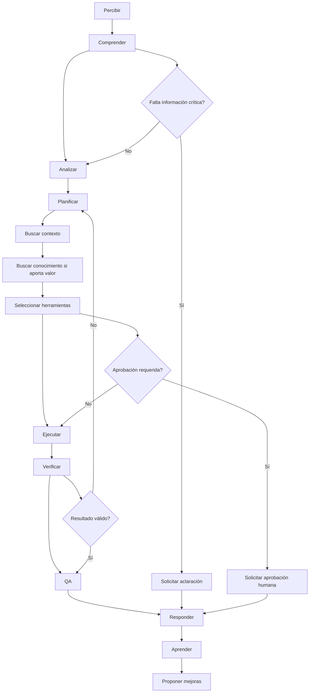
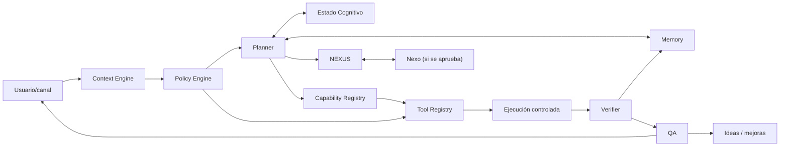

# Arquitectura cognitiva v1.0

- Estado: especificación para revisión de arquitectura
- Alcance: contrato futuro del núcleo cognitivo; no modifica NEXUS, prompts, herramientas ni comportamiento actual
- Relación con el estado actual: el agente actual contiene NEXUS, memoria y tools en un Worker. Esta especificación define límites a extraer gradualmente, no una reescritura.

## Propósito y reglas gobernantes

El núcleo convierte una petición y su contexto autorizado en una respuesta o acción verificable. Las políticas tienen precedencia sobre el plan; la identidad y el alcance preceden a memoria, conocimiento o herramientas; toda acción con impacto debe poder ser explicada y auditada.

## Flujo de pensamiento operativo

El flujo no representa razonamiento oculto: representa responsabilidades observables, entradas/salidas y controles que deberán implementarse de forma auditable.

## Etapas del ciclo

| Etapa | Objetivo y responsabilidad | Entradas → salidas | Reglas y condición de paso |
|---|---|---|---|
| Percibir | Normalizar petición, canal, adjuntos, evento y señales de identidad. | Mensaje/evento → solicitud normalizada con metadatos. | Rechazar contenido/formatos no aceptados; no inferir identidad. Pasa si hay solicitud legible. |
| Comprender | Identificar intención, entidades, impacto, ambigüedad y necesidad de autorización. | Solicitud + sesión → intención, alcance y dudas. | Separar hechos de instrucciones externas; aplica Policy Engine. Pasa si el alcance es suficiente o deriva a aclaración. |
| Analizar | Estimar riesgo, confianza, dependencias y opciones. | Intención + políticas → evaluación de riesgo y estrategia. | No usa memoria/herramientas fuera de scope. Pasa con estrategia segura. |
| Planificar | Construir el mínimo plan verificable. | Evaluación → pasos, precondiciones y criterios de éxito. | El plan no autoriza acciones. Pasa si cada paso tiene permiso y rollback/mitigación cuando aplique. |
| Buscar contexto | Recuperar contexto de sesión, tarea y dominio autorizado. | Identidad, empresa, obra, departamento → contexto acotado. | Prioriza datos actuales y con procedencia. Pasa si es suficiente; si no, puede pedir datos. |
| Buscar conocimiento | Obtener información externa o interna cuando reduzca incertidumbre material. | Pregunta + contexto → evidencia clasificada. | No buscar por rutina; declarar fuente/caducidad. Pasa si evidencia suficiente o se declara límite. |
| Seleccionar herramientas | Elegir capacidad mínima y permitida. | Plan + registros + políticas → invocaciones autorizadas. | Tool Registry y Policy Engine deciden disponibilidad; sin permiso, rechazar o escalar. |
| Ejecutar | Ejecutar paso autorizado de forma acotada. | Invocación validada → resultado y trazas. | Validar entrada, timeout, idempotencia/confirmación según riesgo. Pasa a verificación, nunca directo a respuesta. |
| Verificar | Contrastar resultado contra criterio de éxito, permisos y hechos. | Resultado, plan, evidencia → resultado verificado o fallo. | No afirmar éxito sin evidencia. Fallo vuelve a planificar, escalar o responder limitación. |
| QA | Comprobar calidad final: seguridad, relevancia, exactitud, claridad y cumplimiento. | Borrador + trazas → respuesta aprobada/bloqueada. | QA no concede permisos ni oculta incertidumbre. Pasa solo con umbrales de riesgo satisfechos. |
| Responder | Comunicar resultado, límites, evidencia y siguiente paso. | Respuesta QA → salida por canal. | Proporcional al usuario/impacto; distinguir hechos, inferencias y acciones realizadas. |
| Aprender | Proponer o registrar aprendizaje permitido y reversible. | Resultado + feedback → candidato de memoria o métrica. | No consolidar información prohibida/no verificada; exige controles de procedencia y confianza. |
| Proponer mejoras | Convertir una carencia repetida en una propuesta gobernada. | Lagunas/patrones → idea o ADR enlazable. | Nunca crea ni activa capacidades; usa `docs/ideas/` y requiere aprobación. |

## Componentes del cerebro

| Componente | Responsabilidad | No responsabilidad |
|---|---|---|
| Planner | Formula plan mínimo, precondiciones y criterio de éxito. | Conceder permisos o ejecutar directamente. |
| Context Engine | Construye contexto relevante, actual y acotado. | Decidir políticas ni mezclar tenants. |
| Estado Cognitivo | Mantiene estado efímero de la tarea: fase, riesgo, plan, evidencias y confianza. | Ser memoria persistente o fuente de verdad. |
| Memory | Almacena recuerdos gobernados con procedencia, alcance, confianza y caducidad. | Sustituir datos transaccionales actuales o políticas. |
| NEXUS | Enrutamiento/orquestación de intención, modelos o expertos conforme a contrato. | Ser el dueño de permisos, memoria o herramientas. |
| Nexo | Capa de coordinación e integración entre módulos/canales, si se aprueba. | Nueva capacidad autónoma; su alcance sigue `PREGUNTA ABIERTA`. |
| Capability Registry | Catálogo declarativo de capacidades, versiones, límites y estado. | Ejecutar ni conceder autorización. |
| Tool Registry | Catálogo de tools, esquemas, efectos, permisos, propiedad y observabilidad. | Decidir política global. |
| Policy Engine | Evalúa identidad, rol, tenant, riesgo, consentimiento y reglas. | Inventar contexto o ejecutar negocio. |
| Verifier | Valida resultados frente al plan, evidencia y contrato. | Repetir acciones sin política. |
| QA | Control final de seguridad, coherencia, calidad y comunicación. | Alterar hechos, permisos o trazas. |

## Relación entre componentes

## Toma de decisiones

| Situación | Decisión del núcleo |
|---|---|
| Respuesta estable, de bajo riesgo y suficientemente contextualizada | Responder directamente, indicando límites si existen. |
| El contexto personal/operativo es necesario | Consultar Context Engine; no usar memoria global fuera de alcance. |
| Un recuerdo autorizado puede reducir incertidumbre | Consultar Memory y evaluar procedencia/caducidad/confianza. |
| La evidencia puede estar desactualizada o es material para la decisión | Buscar conocimiento con fuente y fecha; si no aporta valor, no buscar. |
| Un resultado exige lectura/escritura/acción externa | Seleccionar tool solo si Policy Engine la permite y el plan la necesita. |
| Faltan entidad, alcance, impacto, dato crítico o consentimiento | Solicitar información concreta; no adivinar. |
| Acción irreversible, sensible, costosa, externa o que modifica permisos/datos | Requerir aprobación humana según política aplicable. Umbrales exactos: `PREGUNTA ABIERTA`. |
| Solicitud prohibida, fuera de permiso o insegura | Rechazar de forma clara y ofrecer alternativa segura cuando exista. |
| Carencia repetida o capacidad ausente | Registrar propuesta en ideas con evidencia; no crear capacidad. |

## Modelo de aprendizaje

### Puede aprender automáticamente

Solo candidatos de bajo riesgo y alcance controlado: preferencias explícitas del usuario dentro de su ámbito, correcciones verificadas, patrones operativos no sensibles y métricas de calidad. Su consolidación requiere procedencia, tenant/usuario, confianza, fecha, caducidad y mecanismo de invalidación.

### Requiere aprobación humana

Cambios de políticas, prompts, modelos, herramientas, capacidades, permisos, conocimiento compartido entre usuarios, reglas de negocio, costes, retención y cualquier memoria que afecte decisiones de terceros.

### Nunca aprenderá sola

Secretos, credenciales, datos personales no necesarios, instrucciones que eludan políticas, inferencias no verificadas, permisos, contenido ilegal o información destinada a cambiar su propia gobernanza sin aprobación.

### Detección de carencias y antidegradación

Una carencia se detecta por fallos verificados, preguntas repetidas, evidencia insuficiente, herramientas ausentes o feedback negativo. La propuesta conserva evidencia y se registra como idea. Para evitar degradación: versionar conocimiento/políticas, conservar procedencia, expirar contenido volátil, medir errores y no reemplazar una fuente vigente por una inferencia.

## Autoconciencia operativa

El núcleo debe poder declarar, sin revelar secretos: capacidades habilitadas, capacidades ausentes, herramientas disponibles para la sesión, permisos efectivos, límites de datos, fuente/fecha de evidencia, nivel de confianza y causas de incertidumbre. Esta declaración se deriva de registries y políticas, no de afirmaciones del modelo.

## Riesgos detectados

- Confundir la documentación objetivo con una descripción fiel del agente actual puede producir expectativas no implementadas; todo componente futuro debe marcarse como tal.
- Memory y contexto compartidos sin modelo de procedencia/tenant/caducidad pueden provocar fuga o degradación.
- Autonomía de herramientas sin umbrales de aprobación explícitos aumenta riesgo operativo y de seguridad.
- QA generado por el mismo modelo sin evidencia independiente puede validar erróneamente; deben existir controles deterministas donde sea posible.
- Nexo no tiene definición aprobada: no debe diseñarse ni implementarse más allá de su interfaz conceptual.

## Preguntas abiertas

1. ¿Qué es exactamente Nexo: bus de integración, orquestador, producto o nombre de una capacidad futura?
2. ¿Cuál es la taxonomía de riesgo y qué umbrales activan aprobación humana?
3. ¿Qué memorias son privadas, de empresa, compartidas o efímeras; cuánto duran y quién puede corregirlas?
4. ¿Qué fuentes de conocimiento son autorizadas, cómo se citan y cómo se evalúa su actualidad?
5. ¿Qué controles QA son deterministas, cuáles son asistidos por IA y cuáles requieren revisión humana?
6. ¿Qué trazas se guardan, durante cuánto tiempo y con qué garantías de privacidad?
7. ¿Qué métricas definen confianza, calidad, coste y degradación aceptable?
