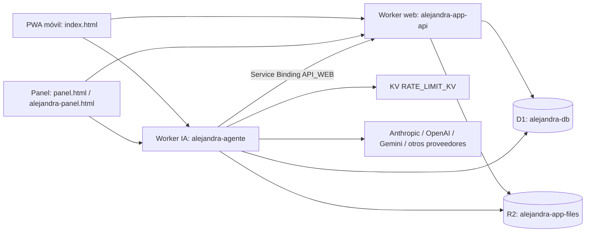

# Arquitectura técnica

## Estado actual auditado

- Frontend: HTML/JS/CSS monolítico sin compilación (`index.html` ≈ 1,3 MB; `panel.html` ≈ 2,2 MB).
- Backend: `worker.js` raíz (≈26.280 líneas) y `alejandra-agente/worker.js` (≈11.133 líneas).
- Datos: D1 compartida y R2 compartido entre Workers; el agente además usa KV para límite de tasa.
- Infraestructura declarada: ambos `wrangler.toml` enlazan `DB` y `FILES`; el agente declara `API_WEB` y `RATE_LIMIT_KV`.
- Automatización: GitHub Actions ejecuta CI en PR/push; Pages, cada Worker, migraciones D1 y secretos se promueven mediante workflows manuales independientes, con `ref` explícito y protecciones de entorno.

## Decisión de evolución

La arquitectura objetivo se implantará por límites de dominio, sin migración masiva: adaptadores de HTTP, servicios de aplicación, repositorios de datos y políticas de autorización. La definición detallada está en [propuesta de organización](architecture/02-PROPUESTA-ORGANIZACION.md).
