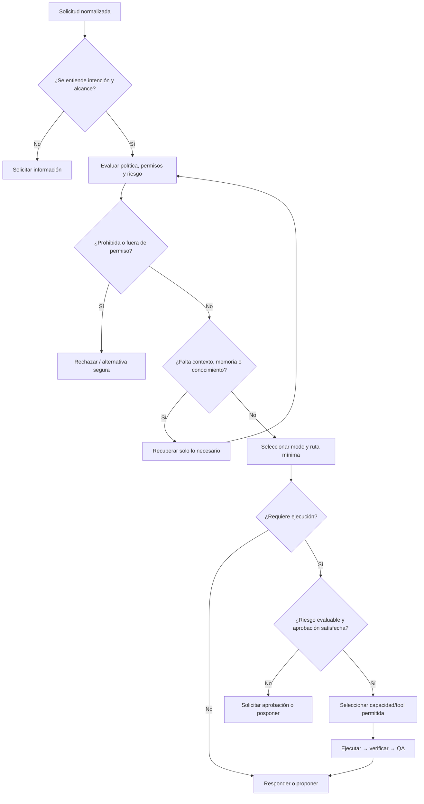
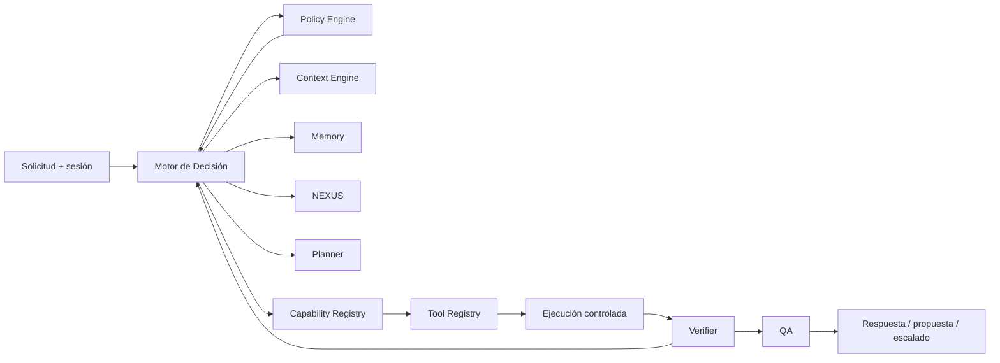

# Motor de Decisión y Modos Cognitivos v1.0

- Estado: especificación para revisión de arquitectura
- Alcance: diseño del componente central de decisión; no implementa ni altera el agente actual
- Dependencias: ADR-0003 aceptado; arquitectura cognitiva v1.0; ARC-001, ARC-003, ARC-004 y ARC-006 pendientes

## Propósito

El Motor de Decisión transforma una solicitud normalizada en una de estas salidas controladas: responder, pedir información, recuperar contexto/memoria/conocimiento, proponer un plan, solicitar aprobación, ejecutar una capacidad autorizada, activar una colaboración futura, rechazar o posponer. No ejecuta por sí mismo, no concede permisos y no sustituye al Policy Engine, Planner, Verifier ni QA.

Su objetivo es elegir la acción mínima que permita avanzar con evidencia, respetando identidad, alcance, riesgo y reversibilidad.

## Responsabilidades, entradas y salidas

| Área | Definición |
|---|---|
| Responsabilidades | Clasificar intención e impacto; seleccionar modo; decidir necesidades de contexto/conocimiento/memoria; determinar ruta de control; exigir aprobación o detenerse cuando ADR-0003 no se cumple. |
| Entradas | Solicitud normalizada, identidad/sesión, contexto disponible, estado cognitivo, políticas efectivas, registros de capacidades/tools, evidencia disponible y restricciones del canal. |
| Salidas | `respuesta_directa`, `solicitar_informacion`, `recuperar_contexto`, `consultar_memoria`, `buscar_conocimiento`, `plan`, `solicitar_aprobacion`, `invocar_tool`, `activar_colaboracion`, `rechazar`, `posponer`. |
| Trazabilidad | Decisión, motivos, evidencia, confianza, riesgo, permisos efectivos, modo y criterio de salida. El formato/retención es `PREGUNTA ABIERTA`. |

## Prioridades y criterios

Orden de prioridad: seguridad de personas/datos → política, permisos y tenant → evaluación de riesgo (ADR-0003) → exactitud y evidencia → continuidad operativa → intención del usuario → coste/latencia.

El motor usa estos criterios, sin fijar aún una fórmula de puntuación: claridad de intención, suficiencia de información, actualidad del contexto, procedencia de evidencia, confianza, impacto, reversibilidad, criticidad, consecuencias, permisos, aprobación humana y disponibilidad de capacidades.

## Flujo interno

## Árbol lógico de decisión

Antes de actuar, el motor debe responder en orden:

1. ¿La solicitud es válida, comprensible y está dentro de un alcance identificable?
2. ¿Quién solicita, para qué tenant/obra/departamento y con qué permisos efectivos?
3. ¿La política permite responder, proponer o ejecutar?
4. ¿Qué modo explica mejor el objetivo sin cambiar permisos ni políticas?
5. ¿Basta la información recibida? Si no, ¿qué dato mínimo falta?
6. ¿Se necesita contexto actual, memoria autorizada o conocimiento verificable? Recuperar solo lo necesario.
7. ¿Se necesita una capacidad o herramienta? ¿Existe y está autorizada?
8. Si hay ejecución, ¿impacto, permisos, reversibilidad, criticidad, consecuencias y aprobación humana son evaluables conforme a ADR-0003?
9. ¿Hace falta una colaboración/agente futuro? Solo si Capability Registry lo declara y la política lo permite; de lo contrario proponer o posponer.
10. ¿La evidencia y confianza permiten responder? Si no, declarar incertidumbre, pedir datos, proponer o rechazar.

## Rutas de decisión

| Condición | Decisión |
|---|---|
| Hecho estable, bajo riesgo, contexto suficiente y confianza adecuada | Responder directamente. |
| Ambigüedad o dato crítico ausente | Solicitar información adicional, concreta y mínima. |
| Contexto operativo actual necesario | Recuperar contexto acotado por identidad/tenant. |
| Recuerdo autorizado, vigente y relevante | Consultar memoria con procedencia y confianza. |
| Evidencia material inexistente, incompleta o volátil | Consultar conocimiento/fuentes autorizadas. |
| Acción requiere efectos sobre sistemas/datos | Evaluar riesgo y seleccionar tool mínima permitida. |
| Capacidad futura especializada declarada | Solicitar/activar colaboración solo bajo registry, política y aprobación aplicable. |
| Acción de riesgo no evaluable o aprobación ausente | Proponerla, solicitar aprobación o posponer; nunca ejecutar. |
| Solicitud prohibida, insegura o sin permisos | Rechazar y, si procede, ofrecer alternativa segura. |
| Decisión depende de información, capacidad o responsable no disponible | Posponer con causa, dependencia y siguiente paso. |

## Modos cognitivos

Los modos son perfiles de prioridad y control, no personalidades, permisos ni bypasses. Policy Engine y ADR-0003 prevalecen siempre. Las herramientas preferentes son categorías conceptuales; su catálogo real depende de Tool Registry.

| Modo | Objetivo y prioridades | Herramientas preferentes | Razonamiento / verificación | Criterio de salida |
|---|---|---|---|---|
| Conversación | Aclarar, orientar y responder con utilidad. Prioriza claridad y contexto. | Contexto, memoria permitida. | Proporcional; verificar afirmaciones materiales. | Respuesta clara o pregunta concreta. |
| Ingeniería | Analizar problema técnico con seguridad y evidencia. | Conocimiento técnico, cálculos/verificadores autorizados. | Alto; supuestos explícitos y comprobables. | Resultado trazable, límites y recomendaciones. |
| Gestión | Apoyar operación, coordinación y seguimiento. | Contexto de negocio, datos autorizados, planificación. | Medio/alto según impacto. | Plan, estado o acción autorizada verificable. |
| Auditoría | Evaluar cumplimiento, evidencia y riesgos. | Lectura de datos, historial, verificadores. | Alto; independencia de evidencia y trazabilidad. | Hallazgos clasificados y acciones propuestas, no auto-remediación. |
| Investigación | Reducir incertidumbre mediante fuentes. | Conocimiento/fuentes autorizadas. | Alto en procedencia/actualidad. | Síntesis con fuentes, confianza y lagunas. |
| Planificación | Construir pasos, dependencias, riesgos y criterios de éxito. | Contexto, Planner, conocimiento necesario. | Medio/alto; no ejecuta por planificar. | Plan mínimo, reversible y aprobable. |
| Programación | Diseñar, revisar o modificar software autorizado. | Repositorio, análisis, pruebas, herramientas de desarrollo autorizadas. | Alto; contrato, seguridad, pruebas y rollback. | Propuesta/revisión o cambio solo con permisos y verificación. |
| Emergencia | Contener daño y preservar seguridad/evidencia. | Contexto crítico, runbooks, comunicaciones autorizadas. | Máximo; mínima acción reversible. | Contención, escalado humano y estado documentado. |
| Creatividad | Generar opciones o artefactos no factuales. | Capacidades creativas autorizadas. | Bajo para ideación; alto para derechos, marca, datos o publicación. | Opciones etiquetadas como propuestas. |
| Documentación | Crear, estructurar o actualizar documentación. | Contexto versionado, ADRs, plantillas. | Medio; máxima coherencia y trazabilidad. | Documento consistente, con pendientes explícitos. |

## Matriz de decisiones

| Tipo de petición | Modo principal | Recursos/capacidades | Verificación | Confianza mínima | Acción esperada |
|---|---|---|---|---|---|
| Pregunta general | Conversación | Contexto; conocimiento si es volátil | Coherencia/fuentes si aplica | Media | Responder o declarar límite. |
| Cálculo o criterio técnico | Ingeniería | Contexto técnico, conocimiento, verificador | Supuestos, unidades, evidencia | Alta | Responder con cálculo verificable. |
| Consulta operativa | Gestión | Contexto y datos autorizados | Scope/actualidad | Media/alta | Estado, recomendación o plan. |
| Revisión de cumplimiento | Auditoría | Evidencia autorizada, historial | Trazabilidad e independencia | Alta | Hallazgos/propuesta; no remediar automáticamente. |
| Tema nuevo o cambiante | Investigación | Fuentes autorizadas | Procedencia, fecha, contradicciones | Media/alta | Síntesis con incertidumbre. |
| Solicitud de plan | Planificación | Planner, contexto, riesgo | Dependencias, reversibilidad | Media | Plan y aprobaciones requeridas. |
| Cambio de software | Programación | Repositorio, pruebas, herramientas | Tests, revisión, rollback | Alta | Propuesta o ejecución aprobada. |
| Incidente urgente | Emergencia | Runbook, contexto crítico | Riesgo/permiso antes de cada acción | Alta | Contener/escalar/posponer. |
| Ideación | Creatividad | Generador autorizado | Restricciones aplicables | Baja/media | Alternativas, no hechos. |
| Crear/actualizar documentación | Documentación | Fuente versionada, ADRs | Coherencia y enlaces | Alta | Documento y pendientes. |

## Relación con el Núcleo Cognitivo

El Motor de Decisión coordina rutas; los componentes especializados conservan su responsabilidad. Ningún modo puede saltarse Policy Engine, Tool Registry, Verifier, QA o ADR-0003.

## Riesgos y preguntas abiertas

- Sin taxonomía de riesgo/umbrales aprobados (ARC-001), el motor solo puede fijar el principio, no automatizar decisiones de aprobación.
- Sin catálogo de tools y capacidades (ARC-006), las “herramientas preferentes” son categorías, no permisos implementables.
- Activación de agentes depende de definición de Nexo y modelo de colaboración (ARC-003); no se presupone que exista.
- QA independiente, trazas y métricas de confianza siguen pendientes (ARC-004/ARC-008).
- Una clasificación de modo errónea no debe cambiar permisos ni ejecutar; el modo debe ser explicable, revisable y sustituible.

## Decisiones abiertas

1. ¿Un usuario puede seleccionar modo, o es solo decisión del sistema; y cómo se resuelven conflictos?
2. ¿Qué umbral de confianza es suficiente por modo y por acción?
3. ¿Qué modos pueden coexistir y cuál tiene precedencia en solicitudes mixtas?
4. ¿Qué eventos habilitan el modo Emergencia y quién puede activarlo?
5. ¿Qué contrato tendrá `activar_colaboracion` y qué aprobaciones requiere?
