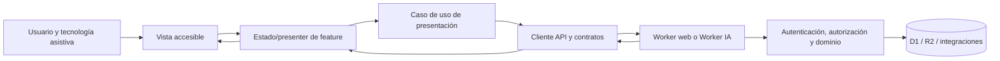

# Arquitectura de la capa de presentación

- Estado: **Vigente**
- Fecha: 2026-08-02
- Propietario: Arquitecto del Proyecto
- Decisión asociada: `ADR-0012` (Aceptado, 2026-08-02)
- Alcance: interfaz de campo, oficina, administración y conversación; no modifica la API, los Workers ni la funcionalidad actual.

## Propósito y filosofía

La presentación es un consumidor de capacidades autorizadas, no la sede de las reglas de negocio. Debe permitir que una persona encuentre, comprenda y ejecute únicamente las acciones que le corresponden, con un contexto visible de empresa, departamento y obra. La misma regla protege al producto y al trabajo paralelo: cada vista puede evolucionar sin copiar reglas de autorización, contratos HTTP o estilos fundamentales.

Esta arquitectura no prescribe un framework. La primera extracción podrá conservar JavaScript nativo si satisface los contratos definidos aquí. Una adopción futura de framework requerirá una decisión separada y evidencia de valor; no se incorpora una dependencia por moda.

## Objetivos

- Separar composición visual, estado de pantalla, clientes de API y reglas de dominio.
- Aislar las aplicaciones de campo, oficina y administración, manteniendo componentes y contratos compartidos explícitos.
- Permitir añadir una vista o un vertical sin editar rutas, estilos ni lógica de vistas no relacionadas.
- Reducir conflictos de merge mediante límites por aplicación, feature y paquete.
- Establecer una base para temas, accesibilidad, responsive e internacionalización.
- Mantener compatibilidad funcional y de URLs durante la migración incremental.

No son objetivos de esta fase cambiar rutas, autenticar de otra manera, sustituir Workers, convertir la PWA en una SPA ni hacer un refactor masivo.

## Evidencia: estado actual

El inventario se limita a hechos comprobables en el repositorio a fecha de este documento.

| Entrada | Tamaño | Observaciones verificables |
|---|---:|---|
| `index.html` | 1.34 MB | PWA de campo: 227 funciones, 34 `fetch`, 773 manejadores `onclick` y 443 usos de `innerHTML`. Contiene HTML, CSS, navegación, estado, acceso a API, exportaciones y módulos operativos. |
| `panel.html` | 2.24 MB | Panel de oficina: 532 funciones, 50 `fetch`, 1.180 `onclick` y 413 usos de `innerHTML`. Concentra dashboards, tablas, administración, configuración, chat y flujos operativos. |
| `alejandra-panel.html` | 141 KB | Panel de conversación/administración del agente, con su propia autenticación, navegación y llamadas tanto al Worker IA como al Worker web. |
| `admin.html` | 25 KB | Administración heredada con URL del Worker y token almacenado en el propio documento. |

Las cuatro entradas mezclan estructura HTML, estilos, listeners inline, renderizado imperativo, estado local, URL de API y llamadas HTTP. `index.html` y `panel.html` mantienen además una URL de API configurable mediante `localStorage`; los otros paneles declaran URLs de Workers distintas. Las dependencias de UI se cargan directamente desde CDN (entre otras: Tabulator, Chart.js, SheetJS, ExcelJS, jsPDF, jsQR, marked y highlight.js), con versiones no centralizadas por aplicación. La PWA comparte `manifest.json` y `sw.js`; su caché cubre navegación y recursos, pero el contrato offline de cada feature no está delimitado por módulo.

### Problemas reales que esta propuesta trata

1. **Acoplamiento de responsabilidades.** Cambiar una pantalla puede afectar a navegación, llamadas, estado y estilos en el mismo archivo, elevando el riesgo de regresión y de conflicto.
2. **Duplicación de infraestructura de presentación.** Autenticación, configuración de URL, renderizado, navegación y tokens visuales aparecen en más de una entrada sin una fuente de verdad explícita.
3. **Límites de autorización poco visibles en UI.** La interfaz decide visibilidad y acciones junto al renderizado. La autorización real debe continuar siempre en el Worker, pero la composición actual dificulta revisar qué se oculta como conveniencia y qué es una garantía de servidor.
4. **Diseño reutilizable no institucionalizado.** Existen patrones visuales, pero no un catálogo versionado de tokens, componentes y contratos de accesibilidad.
5. **Escalabilidad de navegación y responsive.** La navegación está repartida entre código y marcado de cada entrada; el comportamiento responsive no se valida como contrato común de cada vista.
6. **Evolución difícil de internacionalizar.** Las cadenas de interfaz viven junto al marcado y la lógica, por lo que no hay límite que permita extraer catálogos sin modificar features.

No se afirma que todo `innerHTML`, CDN o JavaScript nativo sea un defecto por sí mismo. Son señales de concentración que justifican introducir límites y contratos antes de tocar implementación.

## Arquitectura objetivo

La arquitectura se organiza por aplicación y feature. Un feature posee sus pantallas, composición, estado de pantalla, adaptadores de datos y pruebas; no exporta detalles internos. Las capas solo dependen hacia dentro: una vista usa un presenter/estado; este usa un caso de uso de presentación; el cliente HTTP usa contratos compartidos. Ninguna capa de presentación consulta D1/R2, conserva secretos ni sustituye la autorización de los Workers.

```text
apps/
  campo/                         # PWA de trabajo de campo
    src/{app,routes,features,platform,assets}
  oficina/                       # Panel de oficina y dashboards operativos
    src/{app,routes,features,platform,assets}
  administracion/                # Configuración y administración autorizada
    src/{app,routes,features,platform,assets}
  conversacion/                  # Chat y superficies del agente
    src/{app,routes,features,platform,assets}
packages/
  design-system/                 # tokens, temas, primitivas y patrones accesibles
  presentation-core/             # navegación, estado de sesión, i18n, errores, telemetría UI
  api-clients/                   # clientes tipados/adaptadores HTTP por Worker
  contracts/                     # DTO, errores y contratos transversales ya previstos
  authz/                         # políticas puras compartidas, sin decidir acceso servidor
  domain/                        # reglas puras, sin DOM, fetch, D1/R2 ni secretos
docs/
  architecture/FRONTEND_ARCHITECTURE.md
```

Los nombres son estructura objetivo, no órdenes de crear o mover directorios ahora. Las aplicaciones pueden compartir un mismo despliegue mientras exista un límite de código; separar artefactos de despliegue será una decisión posterior basada en necesidades de seguridad, caché y operación.

### Aplicaciones y límites

| Aplicación | Responsabilidad | Puede reutilizar | No debe contener |
|---|---|---|---|
| Campo | Flujos móviles, conexión variable, cámara/escáner y acciones rápidas. | `design-system`, sesión, contratos y features publicados. | Lógica de oficina, administración o acceso directo a datos. |
| Oficina | Revisión, tablas, dashboards y operaciones de escritorio. | Paquetes compartidos y features sin dependencias de viewport. | Políticas de dominio duplicadas o tokens/URLs de API propios. |
| Administración | Configuración y gestión de alcance administrativo. | Sistema de diseño, sesión, contratos y controles de confirmación. | Privilegios implícitos por ser una pantalla; el servidor conserva la decisión. |
| Conversación | Chat, evidencias y acciones propuestas por el agente. | Sistema de diseño, sesión, contrato de streaming y políticas de presentación. | Ejecutar una acción irreversible sin el flujo de confirmación y la autorización del backend. |

### Estructura interna de una aplicación

```text
src/
  app/                 # bootstrap, proveedores, composición global, límites de error
  routes/              # tabla declarativa de rutas y carga de vistas
  features/
    inventario/
      views/           # componentes/pantallas sin acceso HTTP directo
      state/           # estado transitorio, presenter o controller de la feature
      application/     # casos de uso de presentación y mapeo de DTO a modelo de vista
      data/            # adaptador que usa api-clients; sin reglas de negocio
      tests/
  platform/            # cámara, almacenamiento local, service worker, share; APIs del navegador aisladas
  assets/
```

Una feature nueva se registra mediante un manifiesto de rutas y navegación de su propia aplicación. Las extensiones solo usan puntos de extensión declarados (ruta, navegación, permiso de presentación, tema y contrato); no editan un `switch` global ni importan internals de otra feature. La composición de dashboards se hace con widgets publicados y contratos de datos, no copiando consultas HTTP en cada tarjeta.

## Sistema de diseño, estilos y temas

`packages/design-system` será la única fuente de tokens visuales: color semántico, tipografía, espaciado, elevación, radios, breakpoints, z-index, movimiento y estados de foco/error. Los tokens se exponen como propiedades CSS y una capa de tipos/documentación; los componentes no codifican colores o medidas de marca directamente.

- Primitivas: botón, enlace, campo, select, diálogo, tabla, tarjeta, alerta, icono, spinner y layout.
- Patrones: cabecera de contexto, navegación, formulario con validación, tabla operativa, estado vacío/error, confirmación de riesgo, carga y auditoría visible.
- Temas: `base` obligatorio y variantes por marca/contraste mediante tokens; no temas bifurcados por feature. La preferencia se guarda separada del token de sesión y admite `prefers-color-scheme`.
- Estilos: alcance por componente/feature, sin selectores globales salvo reset, tokens y tipografía. No estilos inline nuevos salvo valores calculados que no puedan expresarse con clases o variables CSS.
- Dependencias de UI: se declaran en un manifiesto de build/bloqueo de versiones por aplicación. La migración elimina cargas CDN duplicadas solo cuando la feature afectada esté cubierta por pruebas.

## Flujo de datos y relación con backend



El cliente adjunta únicamente las credenciales y cabeceras aprobadas, traduce transporte a errores de interfaz y no aplica decisiones de empresa, departamento, propiedad o riesgo. El Worker sigue autenticando, autorizando y limitando cada operación antes de datos, como exige `AGENTS.md`. El estado de UI distingue datos de servidor, estado de pantalla y preferencias locales; la cache local nunca es autoridad para permisos ni datos críticos.

Las URL de API, versionado de contrato, reintentos, timeouts y formato de errores se centralizan en `api-clients`. Las rutas del Worker no se importan como cadenas libres desde las vistas. Un cambio de contrato se publica con compatibilidad o migración explícita y se prueba en ambos lados.

## Accesibilidad, responsive e internacionalización

- Cada ruta declara título, landmarks, orden de foco, atajos y comportamiento de escape/diálogo. Los componentes se usan con HTML semántico antes que ARIA; ARIA complementa, no corrige, semántica ausente.
- El mínimo de aceptación por pantalla incluye teclado completo, foco visible, mensajes de error anunciables, contraste conforme a WCAG 2.2 AA y objetivo táctil proporcional al contexto de campo.
- Campo se diseña móvil y offline-aware; oficina, administración y dashboards son desktop-first sin impedir un acceso seguro y usable desde pantalla reducida. Los breakpoints vienen de tokens, no de decisiones ad hoc por pantalla.
- Las cadenas usan claves por feature y catálogos (`es` inicial). Formatos de fecha, número, moneda y pluralización pasan por una interfaz de locale. Queda prohibido concatenar frases traducibles con datos; la introducción de nuevos idiomas no debe requerir tocar lógica de negocio.

## Convenciones y buenas prácticas

- Nombres por dominio y acción (`features/checklists`, `loadChecklistSummary`), no por tecnología o ticket temporal.
- Vistas deterministas y pequeñas; efectos, temporizadores, `fetch`, `localStorage`, cámara y service worker se encapsulan en `platform`, estado o adaptadores.
- El contenido externo o generado por IA se trata como no confiable: escapar por defecto y sanear cualquier HTML permitido mediante una política explícita.
- Las acciones de riesgo muestran contexto, impacto y confirmación; la confirmación visual no es autorización.
- Un componente compartido se promueve solo tras dos usos reales compatibles; antes vive con su feature para evitar abstracción prematura.
- Cada feature conserva pruebas de renderizado/estado y pruebas negativas de visibilidad de controles. Los clientes API prueban errores, caducidad de sesión y contratos.

## Antipatrones prohibidos en trabajo nuevo

- Añadir reglas de negocio, autorización o SQL en la presentación.
- Usar el rol guardado en navegador como fuente de autorización.
- Introducir URLs de Worker, tokens, rutas HTTP o dependencias CDN directamente en una vista.
- Compartir estado mutable global entre features o aplicaciones.
- Copiar componentes, tokens o CSS para resolver una variación visual.
- Añadir `onclick` inline, `innerHTML` con datos no saneados o estilos inline permanentes.
- Convertir la migración en una reescritura única de `index.html` o `panel.html`.

## Estrategia de migración incremental

Cada PR debe ser reversible y no cambiar comportamiento observable salvo que su ficha lo autorice. El orden inicial se decide por aislamiento y cobertura, no por volumen de código.

1. **Preparación (tras aceptar ADR-0012).** Inventario de rutas/entradas, contratos HTTP consumidos, dependencias CDN, controles de accesibilidad y propietarios de cada feature. Se fija una línea base de pruebas manuales para la primera feature.
2. **Cimientos sin consumo.** Incorporar tokens, primitives, cliente HTTP, contrato de sesión y mecanismo de rutas como paquetes sin cambiar entradas actuales.
3. **Piloto aislado.** Extraer una sola vista de bajo riesgo a una aplicación objetivo detrás de una ruta/feature flag compatible. Comparar permisos, estados de error, responsive y rendimiento con el comportamiento existente.
4. **Migración por vertical.** Mover una feature completa cada vez: vista, estado, cliente, pruebas y documentación. Mantener adaptador temporal hacia las APIs actuales; no duplicar reglas en antiguo y nuevo.
5. **Consolidación.** Retirar el fragmento antiguo solo después de que sus rutas, telemetría/errores, accesibilidad y regresiones estén validadas. La retirada es un PR independiente y reversible por revert.
6. **Evolución.** Añadir aplicaciones o paquetes únicamente cuando un límite de responsabilidad real lo requiera. El cambio de framework, build o despliegue exige ADR si modifica la arquitectura oficial.

## Criterios de revisión

Una PR de presentación se revisa contra esta lista:

1. ¿El cambio pertenece a una sola aplicación/feature y sus dependencias respetan los límites?
2. ¿La vista evita acceso HTTP directo y no contiene autorización de servidor ni secretos?
3. ¿Los contratos, errores, carga y estados vacíos están tipados/documentados y probados?
4. ¿Usa tokens y componentes existentes, o justifica una nueva primitiva?
5. ¿La ruta es accesible por teclado, responsive y preparada para localización?
6. ¿Se mantienen contexto de empresa/departamento/obra, trazabilidad y confirmaciones?
7. ¿La migración conserva comportamiento, tiene rollback y no borra código antiguo prematuramente?
8. ¿El cambio queda aislado para minimizar conflictos de merge con backend, IA y otras features?

## Riesgos y mitigaciones

| Riesgo | Mitigación |
|---|---|
| Reescritura de gran escala o regresiones | Vertical único por PR, línea base y retirada posterior separada. |
| Duplicación temporal | Adaptadores con fecha/criterio de retirada en la ficha de migración; no dos fuentes de verdad permanentes. |
| Dependencias de build innecesarias | JavaScript nativo válido; ADR separado para framework/herramienta nueva. |
| Divergencia visual | Tokens y primitives como fuente única, con revisión de capturas/estados críticos. |
| Falsa seguridad desde UI | El backend conserva autenticación, autorización y límites; se añaden pruebas negativas del servidor donde cambien controles. |
| Conflictos de agentes | Propiedad por aplicación/feature, paquetes con API estable y cambios de contratos revisados de forma explícita. |

## Evolución futura

Este documento es la referencia para toda modificación estructural del frontend. Las decisiones que cambien sus límites (framework, monorepo/build, estrategia de despliegue, routing global, librería de componentes o contratos públicos) se registrarán en un ADR. Los detalles de cada vertical, el inventario vivo de componentes y las guías de contribución se añadirán sin duplicar aquí los contratos de backend, seguridad o dominio. La primera rebanada está documentada en `docs/architecture/FRONTEND_PILOT_SYSTEM_HEALTH.md`; no se amplía hasta su revisión.

## Referencias

- `docs/04-ARQUITECTURA-TECNICA.md`
- `docs/07-UI-UX.md`
- `docs/architecture/02-PROPUESTA-ORGANIZACION.md`
- `AGENTS.md`
- `docs/decisions/ADR-0012-ARQUITECTURA-CAPA-PRESENTACION.md`
