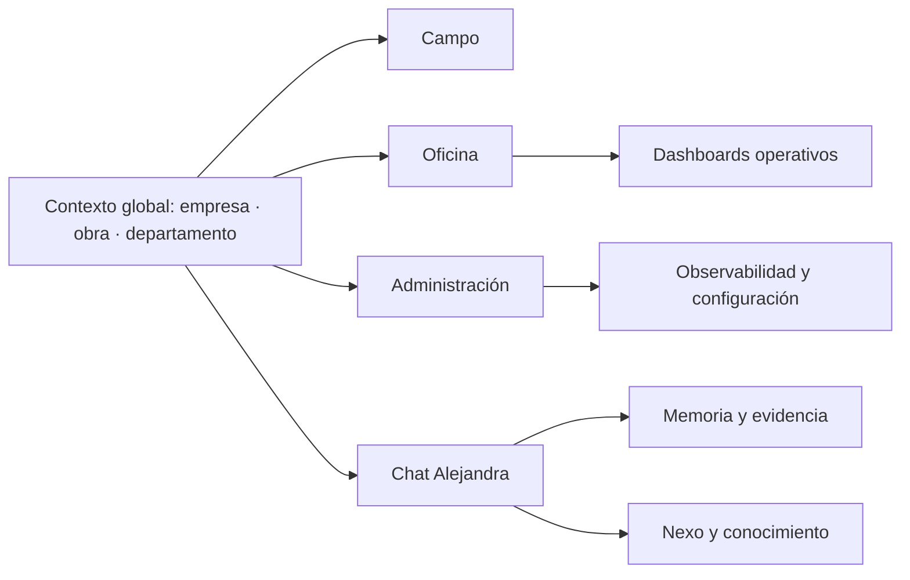

# Visión de producto — capa de presentación de Alejandra

- Estado: Propuesta para decisión de dirección visual
- Fase: P-DESIGN
- Alcance: visión de producto, no implementación ni autorización de migración adicional
- Referencia: `ADR-0012`, `FRONTEND_ARCHITECTURE.md`

## Idea rectora

Alejandra debe sentirse como una **mesa de operaciones tranquila**: una misma inteligencia que acompaña a la persona en campo, en oficina y en administración, sin convertir el trabajo cotidiano en un panel técnico. La interfaz prioriza contexto, siguiente acción y evidencia; la complejidad existe a demanda, nunca como ruido permanente.

La experiencia madura combina tres cualidades: precisión industrial, calidez de compañera experta y control verificable. El resultado no es un chatbot añadido a un ERP: es un espacio de trabajo en el que datos, decisiones y conversación comparten el mismo contexto visible.

## Identidad visual

- **Personalidad:** sobria, próxima, precisa y serena. Evita el neón, el «dashboard de videojuego» y el exceso de tarjetas.
- **Marca:** violeta profundo como señal de Alejandra; azul para información, verde para estado confirmado, ámbar para atención y rojo solo para riesgo/error.
- **Luz:** superficies claras cálidas para oficina; superficies tinta para modo oscuro y operaciones nocturnas. Ambos modos usan la misma jerarquía, no diseños distintos.
- **Tipografía:** `Montserrat` para navegación, títulos y cifras de decisión; `Poppins` para lectura y formularios. Monoespaciada solo para trazas, IDs y evidencias técnicas.
- **Iconografía:** Lucide, trazo uniforme, siempre acompañada de etiqueta en acciones importantes. Los emojis no forman parte del lenguaje final de producto.

## Paleta y tokens propuestos

| Rol | Claro | Oscuro | Uso |
|---|---|---|---|
| Fondo | `#F7F7FB` | `#0E1020` | Lienzo de aplicación |
| Superficie | `#FFFFFF` | `#171A2D` | Paneles, diálogos, tablas |
| Superficie secundaria | `#F0F1F7` | `#222640` | Filtros, elementos seleccionables |
| Texto | `#171827` | `#F3F4FA` | Lectura principal |
| Violeta Alejandra | `#6D4AFF` | `#A995FF` | Acción primaria y foco |
| Información | `#2563EB` | `#75A7FF` | Datos y enlaces |
| Éxito | `#15803D` | `#6EE7A2` | Confirmado/operativo |
| Atención | `#B45309` | `#FBBF61` | Requiere revisión |
| Riesgo | `#C2413B` | `#FF9B96` | Error, bloqueo, acción destructiva |

Escala: espaciado base 4 px (4, 8, 12, 16, 24, 32, 48); radios 8/12/16/24 px por jerarquía; sombra única y suave para overlay; capas 10 navegación, 100 menú, 500 diálogo, 1000 notificación. Los breakpoints son compacto (hasta 639), medio (640–1023) y amplio (1024+).

## Arquitectura de experiencia

El selector de contexto permanece visible en todas las superficies. Cambiarlo explica el alcance antes de actualizar datos. La conversación conserva ese contexto, muestra fuentes/evidencia y separa claramente propuesta, resultado y acción que requiere confirmación.

## Navegación

| Superficie | Patrón |
|---|---|
| Móvil de campo | Barra inferior de 4 destinos: Inicio, Trabajo, Escanear, Alejandra; menú contextual para el resto. Acciones grandes y una sola tarea principal por pantalla. |
| Oficina | Barra lateral plegable: Resumen, Operación, Herramientas, Documentos, Alejandra. Cabecera para buscador, contexto, notificaciones y perfil. |
| Administración | Mismo shell de oficina, espacio separado y visible como «Administración». Navegación por secciones, nunca mezclada con trabajo diario. |
| Chat | Panel lateral en amplio; pantalla completa en compacto. El hilo y el panel de evidencia son dos columnas solo cuando hay espacio. |

## Pantallas maduras

### Inicio de campo

Saludo con obra activa, seguridad/alerta operativa, tareas de hoy y una acción primaria contextual (fichar, registrar, escanear o continuar checklist). La cámara y el modo offline se tratan como capacidades del dispositivo, con estado claro y cola de sincronización visible.

### Oficina y dashboards

Un dashboard empieza por una pregunta operativa («¿qué necesita atención?»), no por una cuadrícula de KPIs. Presenta excepciones, progreso por obra y tendencias; una tarjeta siempre enlaza a la lista filtrada que explica su cifra. Las tablas viven en páginas de trabajo, con filtros persistentes, columnas legibles y detalle lateral, no dentro de tarjetas diminutas.

### Administración y configuración

Configuración agrupada por empresa, personas y acceso, operaciones y automatizaciones. Toda opción muestra alcance y consecuencia. Cambios sensibles emplean una confirmación progresiva con resumen de impacto y enlace a auditoría; el botón no sustituye la autorización del servidor.

### Alejandra, memoria y Nexo

El chat muestra una respuesta utilizable primero y después bloques plegables de «Evidencia», «Plan», «Herramientas usadas» y «Riesgo». Memoria es una vista de registros con procedencia, alcance, confianza, caducidad y corrección; Nexo es un catálogo de fuentes/conectores y resultados recuperables, no una carpeta opaca. Ninguna de estas pantallas permite asumir que una sugerencia es una acción ejecutada.

### Herramientas, notificaciones y observabilidad

Herramientas se presenta por tarea y permiso efectivo, con estado, última ejecución y resultado. Notificaciones se agrupan por prioridad y contexto, se pueden posponer y nunca duplican un estado ya visible. Observabilidad queda reservada a administración: línea temporal de ejecuciones, coste, latencia, errores y trazas vinculadas a una conversación/acción, con filtros y redacción de datos sensibles.

## Componentes y estados

El sistema de diseño final deberá proveer: botón (primario, secundario, peligro), campo, selector, checkbox, chip/badge, tarjeta de resumen, tabla, panel lateral, diálogo, toast, banner, skeleton, empty state, error state, paginación, timeline y command palette. Un componente solo se promueve tras dos usos compatibles.

Estados vacíos explican qué falta, por qué importa y una acción permitida. Carga usa skeleton estructural si se conoce la forma, spinner solo para bloqueos breves. Errores dicen qué operación falló, qué se conserva y la recuperación posible; nunca exponen internals ni convierten una denegación de permiso en un error genérico.

## Accesibilidad y responsive

Todo flujo es completo con teclado, foco visible y texto de error anunciado. Contraste mínimo WCAG 2.2 AA; color nunca es el único indicador. Los diálogos devuelven foco, Escape cancela donde sea seguro, y movimiento respeta `prefers-reduced-motion`. En compacto se reduce densidad y se apilan paneles; no se oculta información de permiso o evidencia crítica.

## Criterio de decisión

La dirección se aprueba si transmite calma y control, hace visible el contexto sin saturar, permite operar rápidamente en campo y sostiene crecimiento de dashboards, IA y administración sin crear tres productos inconexos. Tras aprobación, cada pantalla se diseñará y migrará como una rebanada validada; esta visión no autoriza todavía implementar el frontend nuevo.
